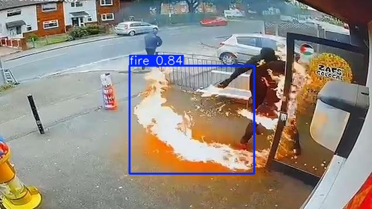

# Fire Detection System

This repository contains a comprehensive fire detection system with three key functionalities: image fire detection, video fire detection, and real-time fire detection. The system uses a pre-trained model to detect fire in different media formats and can be run locally via Streamlit for easy access and interaction.

## Key Features

1. **Image Fire Detection**: Detect fire in static images. The system processes individual images and returns whether a fire is detected or not.
2. **Video Fire Detection**: Detect fire in video files. The system processes each frame of the video to identify the presence of fire.
3. **Real-Time Fire Detection**: This feature allows detection of fire in real-time video streams, such as from webcams or security cameras.

**Sample result**:


<p align="center">
  
</p>

## System Structure

The repository is organized into several key directories and files:

```
.
├── dataset
│   ├── Fire-Detection-Dataset
│   │   ├── test
│   │   │   ├── images
│   │   │   ├── labels
│   │   ├── train
│   │   │   ├── images
│   │   │   ├── labels
│   │   ├── valid
│   │   │   ├── images
│   │   │   ├── labels
│   │   ├── data.yaml          # Configuration file for the dataset
│   
├── doc                        # Documentation for the research fire detection
│
├── model                      # Contains model inference and training code
│   ├── inference               # Scripts for model inference
│   ├── train                   # Scripts for training the fire detection model
│
├── app                        # Main application scripts
│   ├── __init__.py
│   ├── image_processing.py     # Image-based fire detection logic
│   ├── realtime_processing.py  # Real-time fire detection logic
│   ├── video_processing.py     # Video-based fire detection logic
│
├── front_end                  # Front-end application powered by Streamlit
│   ├── __init__.py
│   ├── web_page.py             # Web interface for interacting with the system
│
├── pkgs                       # Utility packages
│   ├── __init__.py
│   ├── frame_processing.py     # Helper functions for processing video frames
│   ├── object_detection.py     # Object detection logic used for fire detection
│
├── README.md                  # Project documentation (you are here)
├── requirements.txt           # Python dependencies
├── run.py                     # Entry point for running the application with Streamlit
├── temp_uploaded_image.jpg    # Temporary storage for uploaded images during detection
```

## How to Run

### Prerequisites

1. **Python**: Ensure you have Python 3.8 or higher installed on your machine.
   
2. **Virtual Environment**: It's recommended to create a virtual environment to manage dependencies.

### Steps to Run the Application

1. **Create a Virtual Environment**

   In your project directory, run the following command to create a virtual environment:

   ```bash
   python -m venv venv
   ```

2. **Activate the Virtual Environment**

   - On Windows:

     ```bash
     venv\Scripts\activate
     ```

   - On macOS/Linux:

     ```bash
     source venv/bin/activate
     ```

3. **Install Dependencies**

   With the virtual environment activated, install the required dependencies using `requirements.txt`:

   ```bash
   pip install -r requirements.txt
   ```

4. **Run the Application**

   Now, use Streamlit to run the main application:

   ```bash
   streamlit run run.py
   ```

This will open the web interface in your browser, where you can test the system's fire detection features for images, videos, and real-time streams.

### Deactivating the Virtual Environment

When you're done, you can deactivate the virtual environment by running:

```bash
deactivate
```

---

### Dataset Structure

The `dataset` directory contains the training, testing, and validation datasets for the fire detection model. Each dataset folder (`train`, `test`, and `valid`) contains subdirectories for images and corresponding labels. The dataset configuration is defined in `data.yaml`.

## Contribution

Feel free to contribute to the project by creating issues, suggesting enhancements, or submitting pull requests. Refer to the `doc` folder for more information on how to contribute effectively.

## License

This project is licensed under the MIT License - see the `LICENSE` file for details.

---

Enjoy detecting fire, and stay safe! 🔥